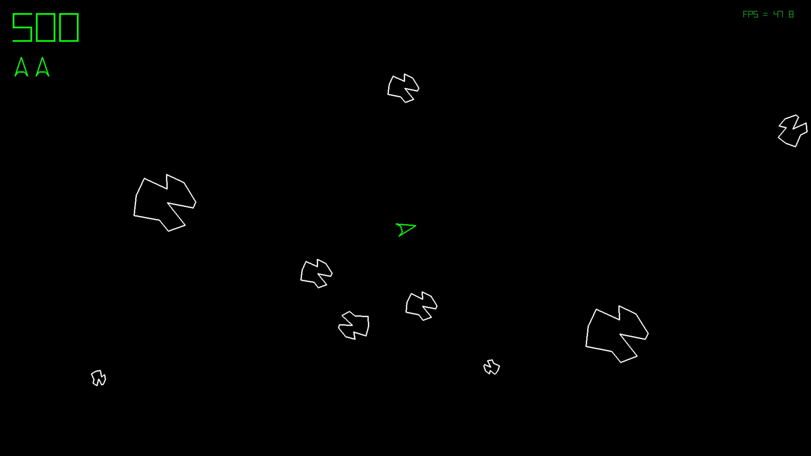

# blasteroidspi
Implementation of the Asteroids game.
  
Inspiration came from the book [Head First C: A Brain-Friendly Guide](https://www.amazon.com/Head-First-C-Brain-Friendly-Guide/dp/1449399916/ref=sr_1_1?crid=3PXLMYX4NOXK9&keywords=head+first+c&qid=1641307105&sprefix=head+first+c%2Caps%), where the requirements and details of objects were born.  
  
In addition, I also took valuable lessons in game implementation from the book [Beginning Python Games Development With PyGame](https://www.amazon.com/Beginning-Python-Games-Development-Second/dp/1484209710/ref=sr_1_1?crid=2RZA8MBSIDFR7&keywords=beginning+python+game+development%27&qid=1641307247&sprefix=beginning+python), which I recommend.  

It's also very important to mention the valuable lessons in game programming and the math involved that I gained through the [Code-It-Yourself video! Asteroids (Simple C++ and Maths!)](https://www.youtube.com/watch?v=QgDR8LrRZhk), plus other videos by the same author that I recommend.  

To run, just clone the repository in terminal, enter the directory and run the following commands:  
`python3 -m venv .venv`  
`source .venv/bin/activate`  
`python3 -m pip install -U pygame`  
`python3 game.py`  
  
Remember that you need to have python3 installed on your system before running the above commands.  

If you are interested in collaborating, please feel free to suggest the inclusion of new features and improvements by github. All suggestions will be analyzed and considered for a future release.  

Top: Learn how to program this game line by line from these [free video lessons on Youtube](https://youtube.com/playlist?list=PLiu4wMrYDH6Jtuu-Z8irw3g9_pUauY1Ta) (in Portuguese language). If you don't speak Portuguese, don't worry, the entire code has comments in english, as well as all the variables used, etc.
    

